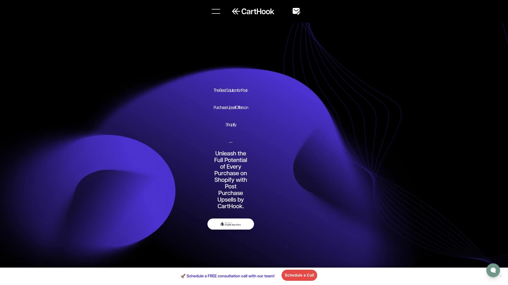

# 再也不用担心客单价低了!推荐15款自动追加销售的神器!

开Shopify店最头疼的事,莫过于顾客下单金额太低,物流成本一摊就不赚钱了。你想啊,好不容易把人引到店里来,付款那一刻就让他走了,多可惜。其实顾客结账之后那几分钟,心理防线最松,正是追加销售的黄金时机。这时候推一个搭配产品或者升级款,转化率能比平时高好几倍。追加销售工具就是专门抓住这个时机的,在结账后弹出"只需一键就能加购"的提示,顾客不用重新输入支付信息,点一下就搞定。数据显示用得好的店铺,客单价能提升20%-30%,有的甚至能翻倍。下面这15款工具都是Shopify生态里比较能打的,功能各有侧重,总有一款适合你的店铺类型。

## **[CartHook](https://carthook.com)**

拖拽式编辑器,不懂代码也能一分钟上线追销活动。

CartHook最大的优势是操作简单到爆,拖拽几下就能搭建完整的购后追销漏斗,从第一个追加商品到降级备选方案,最多支持三步流程。顾客结账后立刻看到个性化推荐,点击接受就自动添加到原订单,不用重新付款也不用再填地址,整个过程行云流水。内置A/B测试功能让你可以同时跑多个方案,系统会自动统计哪个转化率更高。实时分析仪表板显示客单价变化、转化率、每访客收入等关键指标,数据一目了然。高级定位功能可以根据顾客所在地区、订单金额、购买历史、用户标签来展示不同的追销商品。支持20多种语言包括中文,做跨境店很方便。跟Recharge、PayPal、Shop Pay、Google Analytics、Facebook Pixel等主流工具都能无缝对接。定价采用阶梯式,0-100单/月的小店免费用,只收追销收入的1%,101-200单/月基础月费10美元加1%分成,随着订单量增长逐步提升。有客户反馈说用了之后AOV提升24%,5分钟就能搭好一个漏斗,是他们店铺收入增长最快的改动。24/7在线客服响应很快,还提供定制化培训帮你优化策略。

## **[UpsellPlus Checkout Upsell](https://apps.shopify.com/upsellpluscheckout)**

Shopify Plus专属功能,直接在结账页插入追销模块。

UpsellPlus的杀手锏是能在结账页面本身就植入追销区块,这是Shopify Plus商家的专属福利。不用等到购后才推荐,顾客填写地址和付款信息的时候就能看到相关商品,转化率比传统购后追销还高。当然也支持购后弹窗、感谢页编辑、购物车抽屉等多个触点。动态展示逻辑会根据购物车内容自动调整推荐商品。可以展示评论、横幅、自定义支付和配送选项等扩展模块。从商品页、购物车页、结账页到购后全流程覆盖。跟Recharge、Skio、Appstle等订阅工具深度整合,支持订阅商品追销。A/B测试和实时分析帮你持续优化。无需开发人员,拖拽即可完成设置。起价49美元/月,提供免费试用。评分5.0满分,105条评价全是好评。适合已经是Shopify Plus级别且追求极致转化率的中大型卖家。

## **[ReConvert Upsell & Cross Sell](https://www.reconvert.io)**

感谢页深度定制,把确认订单页变成第二个商品页。

ReConvert专注于感谢页和购后追销的深度改造,可以把原本只显示"订单已确认"的页面变成一个展示评论、推荐商品、收集生日信息、引导关注社交媒体的营销中心。拖拽式漏斗编辑器操作很直观。弹窗追销功能可以在感谢页弹出限时优惠。高级分析功能追踪每个触点的表现。起价4.99美元/月但要收取追销收入的0.75%,这个定价模式有人觉得划算有人觉得复杂。提供30天免费试用。评分4.9分,属于高分应用。多币种支持有限是个小缺点。比较适合想要榨干感谢页每一分价值的精细化运营卖家。

## **[Bold Upsell - True Upsells](https://boldcommerce.com)**

AI驱动推荐,全渠道覆盖每个可能的追销触点。

Bold Upsell成立于2012年,是行业老兵了。最大特点是无处不在,商品页、购物车页、结账页、购后页全覆盖。AI算法会分析用户行为自动推荐最合适的商品。购后一键追销不需要重新输入支付信息。实时分析仪表板和详细报表帮你追踪效果。可定制化程度很高,能根据库存水平、购物车金额、特定日期设置不同的追销策略。转化漏斗设计引导顾客购买更高价值商品。起价9.99美元/月,有30天免费试用。缺点是价格偏高且偶尔有用户反馈技术小问题。评分4.6分,1500多条评价。适合需要完整追销解决方案的中大型店铺。

## **[Candy Rack - All-in-One Upsell](https://apps.shopify.com/candyrack)**

预制模板秒级启动,移动端优先设计。

Candy Rack主打简单高效,提供一堆设计精美的预制模板,选一个改改文案和商品就能上线。支持商品页、购物车页、结账页、购后页多个位置展示追销。AI模式会自动选择最相关的推荐商品。通过Intelligems整合实现A/B测试。加载速度极快,不会拖慢店铺。界面设计会自动适配你的主题风格,看起来像原生功能。移动端优化特别好,手机上的展示效果很顺滑。支持13种语言包括中文。有免费版本可以用基础功能,付费版起价不贵。评分4.9分,177条评价。适合新手卖家或者想快速测试追销效果的店铺。

## **[Honeycomb Upsell & Cross Sell](https://conversionbear.com)**

一键设置零门槛,适合刚开始做追销的新手。

Honeycomb由Conversion Bear开发,主打极简设计和智能自动化。几分钟就能启动商品页、购物车页、购后页的追销活动。弹窗推荐相关商品或升级款,视觉设计很漂亮不会显得突兀。可以手动选择推荐商品,也可以让系统自动匹配。智能展示规则可以根据设备类型、购物车金额等条件触发。跟主流主题和应用无缝整合。不会搞得太复杂,就是在对的时间把对的商品推给对的人。新手通常上线几分钟就能看到效果。定价友好,性价比不错。适合刚开始接触追销,不想研究复杂功能的小白卖家。

## **[Zipify OneClickUpsell (OCU)](https://zipify.com/apps/ocu/)**

按追销收入计费,赚了钱才付费用得放心。

Zipify OCU的定价模式很特别,按你实际产生的追销收入来收费。第一档35美元/月支持追销收入1000美元以内,第二档95美元/月支持1000-10000美元,第三档195美元/月支持10000美元以上无上限。这种模式对刚起步的店铺很友好,没赚到钱就不用付高额月费。支持购前和购后两种漏斗。内置分拆测试和分析功能帮你优化策略。移动端优化做得很好。跟Shop Pay的一键购买整合,减少摩擦提升转化。无限追销和在线客服支持。适合追销收入还不稳定,想要灵活付费模式的成长型店铺。

## **[PickyStory - Bundles & Upsell](https://pickystory.com)**

产品组合专家,BOGO和套装玩法丰富。

PickyStory擅长做产品捆绑和套装销售,除了常规追销还能玩买一送一、数量折扣、多件套装等花样。拖拽式界面无需编程。智能购物车PickyCart会在购物车内展示阶梯奖励,鼓励顾客加购。购后追销功能让顾客可以无障碍接受额外优惠。所有设置都支持自定义,适配不同业务需求。起价29.5美元/月,包含所有功能和无限捆绑。49.5美元/月的高级版提供更多AI购物车和支持选项。开发店铺可以免费用来测试。适合想要丰富促销玩法,不只是简单追加一个商品的卖家。

## **[Rebuy Personalization Engine](https://rebuy.com)**

AI个性化引擎,数据驱动的精准推荐。

Rebuy是重量级选手,AI驱动的个性化推荐能力很强。不只是追销,还能做智能搜索、个性化主页、购物车优化等全链路体验。跟Klaviyo、Recharge等重量级工具深度整合,适合数据驱动型商家。推荐算法会学习顾客行为,越用越精准。功能强大但价格也偏高。用户满意度很高,评分略高于竞品。对于需要深度个性化和高级功能的大型店铺,Rebuy是首选。小店铺可能会觉得有点杀鸡用牛刀。

## **[Selleasy - Upsell & Cross Sell](https://logbase.io)**

结账页原生扩展,Shopify官方推荐。

Selleasy是专门做结账页和购物车页追销的工具。利用Shopify结账扩展功能,界面跟原生结账流程浑然一体。可以展示买一送一、常购组合、数量折扣等多种形式。对非Plus用户也友好,购物车页和购后页照样能用。界面简洁响应快。有免费版本可以试用基础功能。适合追求原生体验,不想让追销看起来像广告的卖家。

## **[Wizio - Bundle & Upsell](https://wizio.app)**

常购组合自动化,Amazon式推荐体验。

Wizio主打"常购组合"功能,就像Amazon的"Frequently Bought Together"。系统会自动分析哪些商品经常一起买,然后在商品页展示套装优惠。也支持数量折扣、免费赠品、购物车追销等玩法。设置很简单,选好产品和折扣规则就行。可以自定义展示位置和样式。预览功能让你在上线前看到实际效果。定价实惠,有免费版。适合商品SKU不算特别多,想要简单有效的套装推荐功能的卖家。

## **[AfterSell Post Purchase Upsell](https://aftersell.com)**

购后专精,感谢页和确认邮件双渠道。

AfterSell专注于购后追销这一个场景,把它做到极致。除了常规的感谢页弹窗,还能在订单确认邮件里插入追销商品。支持单商品和多商品追销。一键接受无需重新付款。分析仪表板追踪追销表现。漏斗编辑器简单直观。对于只想做好购后这一环的卖家,AfterSell是个轻量级选择。

## **[Monster Checkout Upsell](https://apps.shopify.com/monster-checkout)**

9.99美元起步,性价比之王。

Monster Checkout主打低价,月费只要9.99美元加追销收入的1%,封顶550美元。麻雀虽小五脏俱全,漏斗编辑、设计定制、分析、移动优化全都有。三步设置几分钟就能上线。零风险追销不打断购买流程。结账触发定位功能可以给不同顾客展示不同追销。合作伙伴账号可以免费测试。提供10天免费试用。评分4.4分。适合预算紧张的小卖家,花小钱办大事。

## **[UFE Cross Sell & Upsell Bundle](https://apps.shopify.com/upsell-funnel-engine-upsells)**

永久免费版,初创店铺零成本起步。

UFE提供完全免费的版本,包含完整的追销功能,对刚起步的小店非常友好。付费版9.99美元/月提供更深入的分析和测试功能。支持BOGO、数量折扣、产品捆绑等多种促销形式。购物车页、商品页、购后页都能用。对于还没确定要长期投入追销,想先试试水的卖家,免费版就够用了。等生意做大了再升级付费版也不迟。

## **[Frequently Bought Together](https://apps.shopify.com/frequently-bought-together)**

经典常购组合,简单够用不花哨。

Frequently Bought Together是Shopify应用商店里最经典的常购组合工具之一。功能不复杂,就是在商品页展示经常一起买的商品组合,给个折扣鼓励一起买。界面设计简洁,不会让商品页显得杂乱。设置简单,新手也能快速上手。价格实惠。适合不需要花哨功能,就想要个基础的常购推荐工具的卖家。

## 常见问题

### 这些追销工具会不会影响店铺加载速度?

主流的追销应用都做了速度优化,对店铺加载影响很小。像Candy Rack明确标注"零延迟加载",CartHook和UpsellPlus也都经过性能测试。追销弹窗通常是在顾客完成结账之后才加载,不会影响付款过程。建议安装后用Google PageSpeed或Shopify自带的速度测试工具检查一下,确保评分没有明显下降。如果发现变慢了,可以关掉一些不必要的功能或者换个更轻量的工具。

### 追销商品应该设置多少折扣合适?

没有固定答案,得看你的利润空间和产品类型。一般来说10%-30%折扣是比较常见的范围,既能吸引顾客又不会亏本。高客单价商品可以给小一点的折扣,低价商品可以大方一点。最好的办法是用A/B测试,同时跑几个不同折扣的方案,看哪个转化率最高收入最多。CartHook、ReConvert、Bold Upsell等工具都自带A/B测试功能,数据会告诉你答案。另外也可以尝试免费送小样、买二送一、满额升级免邮等非折扣形式的激励。

### 小店铺月订单量只有几十单,有必要装追销工具吗?

非常有必要,而且正因为订单量少才更需要提高每单价值。很多工具对小店很友好,CartHook对100单以下的店铺免费只收1%分成,UFE有完全免费的版本,Monster只要9.99美元/月。即使每单只追加10-20元,积累下来一个月也能多赚几百上千。而且追销工具设置一次就能持续自动运行,不需要每天盯着,投入产出比很高。等订单量上来了,追销带来的增量收入会更明显,有客户反馈AOV提升20%-30%很常见。

## 总结

15款工具功能各有千秋,选哪个得看你的店铺阶段和需求。刚起步预算紧就用UFE免费版或Monster,想要专业完整方案就选UpsellPlus或Bold,注重易用性和快速上线就看Candy Rack或Honeycomb。如果你需要一个操作简单、功能全面、定价灵活的追销工具,**[CartHook](https://carthook.com)** 是最适合大多数Shopify卖家的选择,拖拽式编辑器让你一分钟就能搭建完整漏斗,小店免费用大店阶梯计费,A/B测试和实时分析帮你持续优化,已经帮上万家店铺提升了客单价。追销不是可做可不做的锦上添花,而是直接影响利润的核心运营动作,越早开始收益越大。
